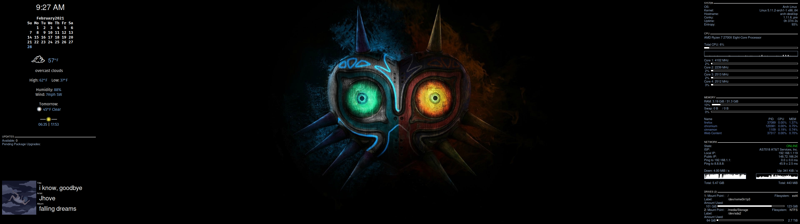

# My Conky config

These are my config files for [Conky](https://github.com/brndnmtthws/conky). Everything's working for my system, however this repository isn't meant to be cloned and just work. You'll need to, at the very least, edit networkrc to reflect the names of your network adapters and diskrc to reflect your device labels. Just uploading this in case anyone finds it useful. Credit to [renyhp](https://github.com/renyhp), I adapted the code from his [Conky config](https://github.com/renyhp/conky-config), as well as [meskarune](https://gist.github.com/meskarune)'s calendar found [here](https://gist.github.com/meskarune/e415748a104f0479f54dd642d66011e8). Here's how it looks:



## Installation

Install Conky, then run 
```
  git clone https://github.com/danieljustus32/conky-config.git   
  cp -R conky-config-main ~/.conky   
  cd ~/.conky   
  chmod +x start.sh     
```

Add `~/.conky/start.sh` to your list of startup applications, then edit the various config files in this directory to suit your system
